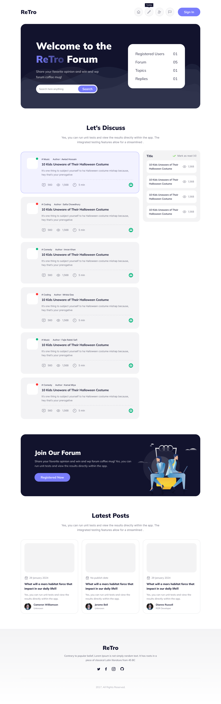

    <h1>Retro Forum</h1>
    
    <h2>This web project aims to create a nostalgic yet engaging platform where users can share their opinions on various topics and stand a chance to win exclusive WP Forum coffee mugs! The website combines retro design elements with modern web technologies to deliver a unique and enjoyable user experience.
    </h2>

## Key Features

- **Opinion Sharing:** Users can express their thoughts on diverse subjects through the interactive forum.

- **Contest Section:** The "Share Your Opinion and Win" feature allows users to participate and win exciting WP Forum coffee mugs.

- **Retro Design:** The website incorporates a visually appealing retro design for a touch of nostalgia.

- **Responsive UI:** Ensuring a seamless experience across various devices with a responsive user interface.

## Technologies Used

- **HTML**
- **CSS**
- **JavaScript**
- **Tailwind CSS**

## Authors

- [@shahiduldeowan](https://www.linkedin.com/in/shahiduldeowan/)
